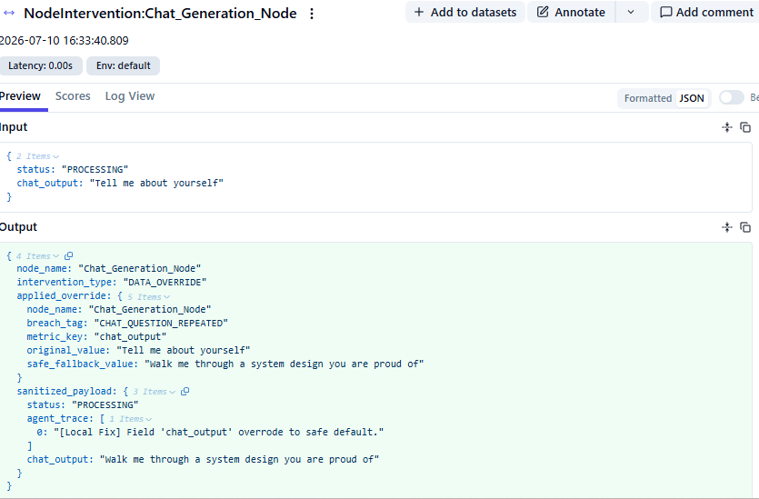
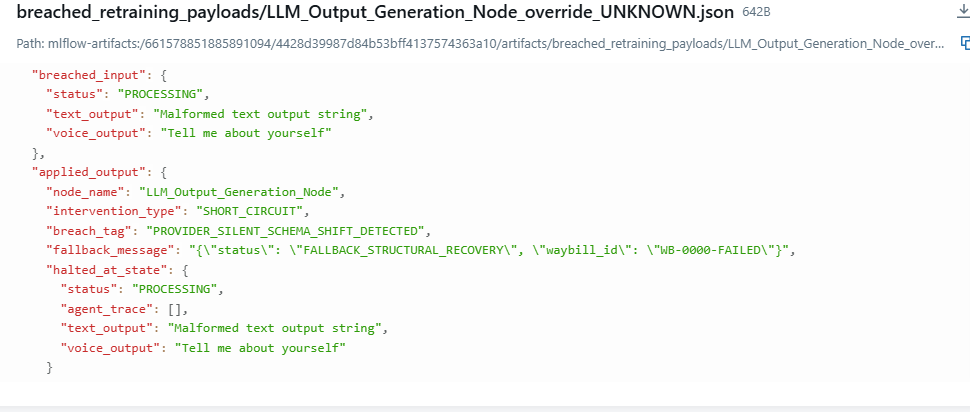

# GuardOps — Runtime Safety Proxy for Multi-Agent Systems

GuardOps is a production-grade inline proxy that intercepts 
payloads between AI agent nodes in real-time — before 
failures cascade across your system.

Most safety tools analyze outputs **after** the pipeline 
completes. GuardOps intercepts **during** execution, at 
every node boundary.

## Live Demo Output: https://drive.google.com/file/d/1WN7BSiIECRDCQpWGIpe_Z3tG32L5jruL/view?usp=sharing

---

## What It Does

When a policy breach is detected, GuardOps takes one of 
two actions:

- **DATA_OVERRIDE** — Mutates the corrupted field in-place 
  and lets the pipeline continue with clean state
- **SHORT_CIRCUIT** — Raises `GuardOpsRefusalIntercept`, 
  halts the entire pipeline instantly, saves the failure 
  state for retraining

Every breach is dual-logged:
- **Langfuse v4** — Live nested spans, mutation diffs, 
  intervention metadata
- **MLflow** — Breach artifacts saved to 
  `mlflow_retrain_data/` for regression testing and 
  fine-tuning loops

---

## How It Works

### User defines:
- **guard_manifest.json**  ← which node, what to check, what action to take
- **custom_guards.py**      ← their business logic
- ### GuardOps handles:
  * **Runtime interception**  ← @guard_runtime decorator
  *  **Policy evaluation**     ← engine resolves rules
  * **Telemetry**             ← Langfuse + MLflow automatic

### Runtime Execution Flow

When a decorated agent executes, GuardOps wraps the complete lifecycle:

```text
[Agent Input Payload]
       │
       ▼
 ┌───────────┐
 │   Agent   │ ──► Executes internal logic, tools, or LLM calls
 └───────────┘
       │
       ▼
[Raw Output Generated]

 ┌───────────┐
 │ GuardOps  │ ──► Loads rules from registry
 │  Engine   │ ──► Resolves custom checks
 │           │ ──► Evaluates policy boundaries
 └───────────┘
       │
       ├─► PASS
       │      └── Payload continues unchanged
       │
       ├─► DATA_OVERRIDE
       │      ├── Replaces unsafe values
       │      ├── Logs artifacts to MLflow
       │      └── Creates intervention spans in Langfuse
       │
       └─► SHORT_CIRCUIT
              ├── Raises GuardOpsRefusalIntercept
              ├── Halts downstream execution
              ├── Saves retraining artifacts
              └── Returns safe failure response
```
---
### The Decorator

```python
@guard_runtime(node_name="CriticAgent")
async def critic_node(payload: dict) -> dict:
    return payload  # GuardOps intercepts automatically
```

### The Manifest

```json
{
  "CriticAgent": [
    {
      "metric_key": "predicted_base_price",
      "condition_type": "UNDER_FLOOR",
      "boundary_limit": 5.00,
      "fallback_value": 5.00,
      "strategy": "DATA_OVERRIDE",
      "breach_tag": "PRICE_UNDER_FLOOR"
    },
    {
      "metric_key": "operational_cost",
      "condition_type": "OVER_CEILING",
      "boundary_limit": 500.00,
      "fallback_value": "Cost ceiling exceeded.",
      "strategy": "SHORT_CIRCUIT",
      "breach_tag": "BUDGET_EXCEEDED"
    }
  ],
  "Voice_Generation_Node": [
    {
      "metric_key": "output",
      "strategy": "DATA_OVERRIDE",
      "checks": [
        {
          "condition_type": "CUSTOM_CHECK",
          "boundary_limit": "custom_guards.check_question_repeat",
          "fallback_value": "custom_guards.recover_next_question",
          "breach_tag": "VOICE_QUESTION_REPEATED",
          "parameters": {
            "session_id": "interview_001",
            "question_bank": ["Tell me about yourself", "..."]
          }
        },
        {
          "condition_type": "CUSTOM_CHECK",
          "boundary_limit": "custom_guards.check_context_loss",
          "fallback_value": "custom_guards.recover_context_anchor",
          "breach_tag": "VOICE_CONTEXT_LOST",
          "parameters": { "session_id": "interview_001" }
        }
      ]
    }
  ]
}
```

### Custom Guards

```python
def check_question_repeat(value: Any, rule_config: dict) -> bool:
    # return True = breach, False = pass
    scores = cosine_similarity(embed(value), embed(past_questions))
    return float(max(scores)) > 0.82

def recover_next_question(value: Any, rule_config: dict) -> str:
    # return the fallback value to inject
    return next_unasked_question_from_bank
```

---

## Supported Condition Types

| Type | Use Case |
|---|---|
| `UNDER_FLOOR` | Numeric minimum enforcement |
| `OVER_CEILING` | Numeric maximum enforcement |
| `REGEX_MISMATCH` | Schema/format validation |
| `CUSTOM_CHECK` | Any custom Python logic |

---

## Real-World Use Cases Demonstrated

**Multi-Agent Logistics Pipeline**
- Price floor enforcement across agent nodes
- Weight ceiling with nested dot-notation 
  (`operational_features.total_weight_kg`)
- LLM schema drift detection via regex

**Voice Interview Agent**
- Repeated question detection via embedding 
  similarity (score 1.00 → breach)
- Context loss detection via LLM-as-judge 
  (GPT-4o-mini coherence check)
- Session-aware — tracks full conversation 
  history across turns

**Chat Interview Agent**
- Contradiction detection against stored 
  candidate facts
- Question repeat with semantic similarity
- Context loss with conversation history

---

## Telemetry Architecture
* **Every breach** →
Langfuse:  nested span with input/output diff
MLflow:    artifact JSON saved for retraining
{
"breached_input": original payload,
"applied_output": what GuardOps did
}

This creates a **data flywheel** — every failure 
automatically generates a labeled training example 
for the next model version.

---

## Installation

```bash
git clone https://github.com/ShrutiShravani/GuardOps
cd GuardOps
pip install -r requirements.txt
```

`.env` required:
# Langfuse Configuration
LANGFUSE_PUBLIC_KEY=pk-lf-...
LANGFUSE_SECRET_KEY=sk-lf-...
LANGFUSE_HOST=https://cloud.langfuse.com

# MLflow Tracking Server
MLFLOW_TRACKING_URI=http://localhost:5000
```

```bash
python -m workers.py
```

---

## Supported Frameworks

Works at the Python function boundary — 
framework agnostic.

✅ LangGraph  ✅ CrewAI  ✅ AutoGen  
✅ OpenAI Agents SDK  ✅ Custom pipelines

---

## Current Limitations

- Dictionary and TypedDict state only
- Pydantic BaseModel not yet supported

---

## Roadmap

**Near-term — already architected:**

- **Logprob confidence interception** — use 
  token-level probability scores from LLM APIs 
  as lightweight hallucination signals. 
  Eliminates the LLM-as-judge API call entirely.

- **Adaptive threshold tuning** — MLflow breach 
  logs feed back into threshold calibration. 
  System observes false positive rate and adjusts 
  similarity thresholds automatically per domain.

- **Modular guard packages** — move beyond single 
  `custom_guards.py` to auto-discovered guard 
  directories per domain (finance/, security/, 
  compliance/)

**Protocol-level (emerging standards):**

- **MCP integration** — expose GuardOps guard 
  tools as MCP server endpoints. LLMs connect 
  via standard protocol, no custom wiring needed.

- **A2A state passing** — as Google's Agent2Agent 
  protocol matures, GuardOps validated state 
  passes between agent nodes via standardized 
  task objects instead of raw dict payloads.

**Production scale:**

- **Real-time audio stream interception** — 
  current voice interception fires after STT, 
  before TTS. Future: intercept raw audio frames 
  mid-generation, cut before user hears broken 
  output. Sub-50ms.

- **Causal tracing** — current system catches 
  bad outputs. Future: trace upstream cause — 
  which retrieval chunk, which turn, which STT 
  token caused the failure. MLflow already 
  captures the breach timestamp; upstream signal 
  logging is the next instrumentation layer.

- **Stateless multi-tenant injection** — move 
  from static manifest to per-request policy 
  injection via `payload["guard_policies"]`. 
  API gateway fetches tenant-specific thresholds 
  from cache and appends dynamically. Zero 
  redeployment for policy changes.


## Langfuse Observability



## MLflow Retraining Artifacts
